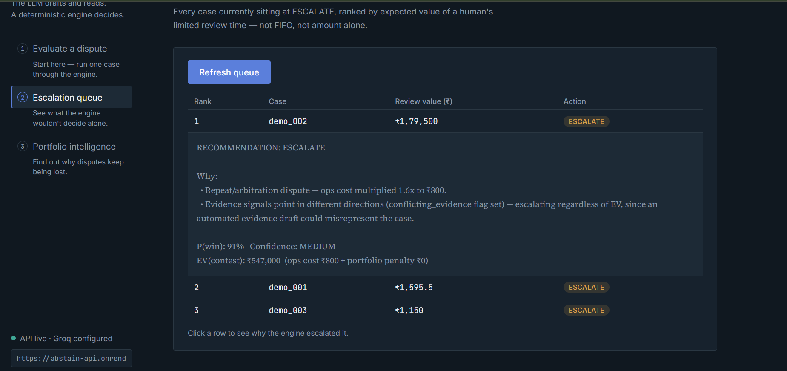
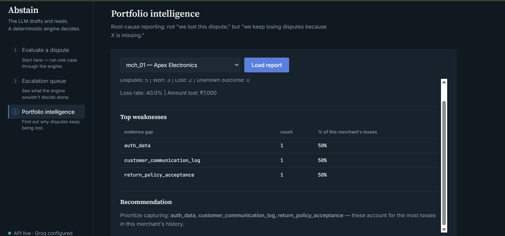

# Abstain
### *The Intelligence Beyond the Dispute*

**The LLM reads the evidence. It never touches the money.**

🔗 **Live demo / Use the app:** [abstain-kappa.vercel.app](https://abstain-kappa.vercel.app/) 

⚙️ **Test the API:** [abstain-api.onrender.com/docs](https://abstain-api.onrender.com/docs)

🎥 **Demo video:** [Watch the 5-minute demo](https://drive.google.com/file/d/1kmbxfUQINjY_97tH_sngFnEZVdPCFyCM/view?usp=sharing)  

---

## Why I built this

Most chargeback automation systems try to answer one question:

> **"Can we win this dispute?"**

That's useful — but incomplete.

A real risk team needs to answer:

> **"Given the evidence, the money at stake, the deadline, and the merchant's risk history — should we contest, concede, or get a human to look at this?"**

That's a different problem, and it needs a different architecture.

So I built Abstain around one rule I didn't compromise on:

**The LLM is never allowed to spend money.**

It reads the evidence and assesses its strength. A separate, deterministic policy engine takes that assessment and makes the financial decision.

And when the evidence isn't good enough?

**It abstains.**

---

## The one-line pitch

**Abstain uses an LLM to understand chargeback evidence, a deterministic engine to decide what to do with it, and a diagnostic layer to explain why merchants — and the whole portfolio — keep losing.**

---

## The core idea

```text
                 ┌────────────────────┐
                 │   Chargeback Case  │
                 └──────────┬─────────┘
                            ▼
                 ┌────────────────────┐
                 │  LLM Evidence      │
                 │  Scorer            │
                 │  reads, doesn't    │
                 │  decide            │
                 └──────────┬─────────┘
                            ▼
                 ┌────────────────────┐
                 │  Deterministic     │
                 │  Decision Engine   │
                 │  decides, doesn't  │
                 │  guess             │
                 └──────────┬─────────┘
                 ┌──────────┼───────────┐
                 ▼          ▼           ▼
             CONTEST     CONCEDE     ESCALATE
                                        │
                                        ▼
                              ┌────────────────────┐
                              │ Human Attention    │
                              │ Ranking by EV      │
                              │ instead of FIFO    │
                              └────────────────────┘
```

The third outcome — **ESCALATE** — is central to the design.

Most AI systems are optimized to always produce an answer.

Abstain is designed to recognize when an automated decision isn't justified and route the case to a human instead.

---

## See it in action

### 1. Evidence → Decision

The console takes the dispute evidence, retrieves relevant context, evaluates the evidence with the LLM, and passes the result into the deterministic decision engine.


### 2. Uncertain cases → Human attention

Escalated cases aren't simply dumped into a queue. They're ranked by **expected value of human review**, so the most valuable cases get attention first.



### 3. From individual disputes → portfolio intelligence

Abstain doesn't stop at deciding individual disputes. It aggregates failures across merchants to identify repeated evidence gaps and systemic problems.



---

## Three layers of intelligence, not one

Most chargeback tools stop at the dispute. Abstain climbs the whole ladder.

```text
                       ABSTAIN
                          │
         ┌────────────────┼────────────────┐
         ▼                ▼                ▼
     DISPUTE           MERCHANT          PORTFOLIO
     What do we do     Why is THIS       Why are we
     with this case?   merchant          losing overall?
                        failing?
         │                │                │
         └────────────────┼────────────────┘
                          ▼
                  ACTIONABLE INSIGHT
```

### Level 1 — Dispute

Evidence in, decision out.

The engine considers evidence strength, economics, deadlines, conflicting evidence, and portfolio risk before choosing:

**CONTEST / CONCEDE / ESCALATE**

### Level 2 — Merchant

A merchant can have an average overall loss rate while repeatedly failing because of one specific evidence gap.

```text
Merchant A
────────────────────────────
Primary weakness:      Customer communication evidence
Loss concentration:    7 of 10 losses
Most affected reason:  Fraud / unauthorized dispute
```

Abstain compares merchant-level patterns against the broader portfolio to distinguish a merchant-specific problem from a systemic one.

### Level 3 — Portfolio

If the same evidence gap appears across multiple unrelated merchants, the problem may no longer belong to one merchant.

```text
PORTFOLIO LOSS ANALYSIS
────────────────────────────────────
Customer communication      7 losses
Missing supporting evidence 5 losses
Delivery verification       4 losses
```

That turns:

```text
Individual dispute
        ↓
Merchant diagnosis
        ↓
Portfolio diagnosis
        ↓
Systemic intervention
```

---

## Why Abstain beats a naive binary system

A binary contest/concede system is forced to choose a side even when the evidence doesn't justify one.

### Scenario 1 — Conflicting evidence

Transaction records point one way. Customer evidence points another.

Instead of forcing a probability threshold, Abstain detects the conflict and **ESCALATES regardless of EV**.

The system doesn't pretend the evidence is clearer than it is.

### Scenario 2 — High-value uncertainty

A ₹15,000+ dispute with weak evidence in both directions can make either automated choice expensive.

Abstain uses self-consistency sampling to detect disagreement across LLM evaluations and routes genuinely uncertain cases to a human with the reasoning already attached.

### Scenario 3 — Portfolio-aware decision

A dispute can look profitable in isolation while creating additional risk for a merchant already near its chargeback threshold.

Abstain incorporates:

* Repeat-dispute cost
* Merchant risk position
* Portfolio risk penalty
* Expected value

The result can be different from what a single-dispute classifier would choose.

These aren't separate demos bolted onto the product — they're decision gates implemented directly in the engine.

---

## Under the hood: the design decisions

### 1. Hybrid retrieval

Chargeback reason codes and evidence requirements are often short and highly specific.

Abstain combines:

* **BM25** for exact reason-code and policy-term matching
* **FAISS** for semantic similarity across evidence

This gives the system both lexical precision and semantic retrieval.

### 2. Self-consistency for uncertainty

Instead of asking an LLM:

> "How confident are you?"

Abstain samples the model multiple times and measures disagreement in evidence-strength scores.

```text
Low disagreement:            High disagreement:

0.82, 0.79, 0.84              0.84, 0.51, 0.23
      ↓                              ↓
Lower uncertainty              Higher uncertainty
      ↓                              ↓
Proceed automatically          Route to human
```

This is deliberately treated as a **disagreement proxy**, not a calibrated statistical confidence interval.

### 3. The LLM never executes the decision

The LLM produces a strict, schema-validated evidence assessment.

It does **not** decide the financial action.

The deterministic engine handles economics:

```text
EV(contest)
    = P(win) × dispute_amount
      − operating_cost
      − portfolio_risk_penalty

EV(concede) = 0
```

The decision engine has **zero import of an LLM client**.

Same inputs → same policy decision.

### 4. Portfolio-aware risk

A dispute doesn't happen in isolation.

A merchant close to its chargeback-rate threshold is treated more conservatively than one comfortably below it.

The engine therefore considers portfolio position alongside case-level economics.

### 5. Repeat-dispute cost multiplier

Repeat and arbitration disputes can have higher operational costs.

Abstain models this explicitly rather than assuming every contest has identical economics.

### 6. Counterfactual evidence

Every ESCALATE or CONCEDE decision can identify:

> **What evidence would change this decision?**

```text
Current decision:  CONCEDE
Missing evidence: Customer communication log

Counterfactual:
If obtained and evidence strength crosses
the threshold → decision may flip to CONTEST
```

The counterfactual reuses the actual decision function with a perturbed input, keeping the what-if logic synchronized with the production policy.

### 7. EV-ranked human attention

Escalated cases are ranked by potential value rather than arrival order.

The goal isn't to eliminate humans.

**It's to make human review more valuable.**

### 8. Fail loud, never silently

If the LLM provider fails after retries, Abstain falls back to a conservative structural heuristic based on evidence completeness.

The result is explicitly tagged:

```text
source: "fallback_heuristic"
```

The system never pretends a degraded result came from the full LLM pipeline.

---

## Architecture

```text
Abstain/
├── app/
│   ├── main.py                      # FastAPI entrypoint
│   ├── models.py                    # Pydantic schemas
│   ├── db.py                        # SQLAlchemy models + session
│   ├── llm_client.py                # provider-agnostic LLM wrapper
│   ├── retrieval/
│   │   ├── hybrid_search.py         # BM25 + FAISS retriever
│   │   └── index_builder.py
│   ├── graph/
│   │   ├── pipeline.py              # LangGraph orchestration
│   │   ├── nodes.py
│   │   └── state.py
│   ├── engine/
│   │   ├── evidence_scorer.py       # LLM assessment + self-consistency
│   │   ├── decision_engine.py       # deterministic EV policy
│   │   ├── portfolio.py             # merchant risk adjustment
│   │   ├── attention_ranking.py     # EV-ranked escalation queue
│   │   └── counterfactual.py        # "what evidence flips this?"
│   └── reporting/
│       └── portfolio_intelligence.py
├── dataset/
│   ├── generate_dataset.py
│   ├── reason_codes.json
│   ├── merchants.json
│   └── disputes.json
├── eval/
│   ├── run_eval.py
│   └── eval_report.md
├── tests/
│   ├── test_decision_engine.py
│   ├── test_counterfactual.py
│   └── test_portfolio_pairs.py
├── frontend/
├── Dockerfile / docker-compose.yml
└── requirements.txt
```

### Pipeline

```text
Dispute
   ↓
Hybrid retrieval
(BM25 + FAISS)
   ↓
LLM evidence assessment
+ self-consistency
   ↓
Deterministic decision
(EV + deadline + portfolio risk)
   ↓
CONTEST / CONCEDE / ESCALATE
   ↓
Counterfactual explanation
   ↓
Merchant + portfolio intelligence
   ↓
EV-ranked human attention
```

---

## Evaluation

I built the evaluation harness around the failure modes that matter for a system making financial decisions.

**57 cases, 56 scored**

### Key results

```text
Precision             63.2%
False-positive cost   ₹5,000
Escalation rate       18%
```

The decision boundary is intentionally conservative: uncertain cases are routed to human review instead of being forced into an automated contest/concede decision.

### What the evaluation measures

* Precision / recall on automated decisions
* False-positive cost
* False-negative cost
* Escalation rate
* Decision-boundary behavior

**ESCALATE is evaluated separately** because abstention is an explicit system behavior, not simply a failed prediction.

The full evaluation methodology and reproducible results are available in `eval/eval_report.md`.

---

## Running it locally

```bash
pip install -r requirements.txt

# .env
GROQ_API_KEY=your_api_key

uvicorn app.main:app --reload --port 8000
# → http://127.0.0.1:8000/docs
```

No `GROQ_API_KEY`?

Leave it blank. The system automatically runs through the fallback heuristic so the decision engine can still be exercised end to end.

```bash
# Evaluation
python eval/run_eval.py

# Tests
pytest
```

---

## Tech Stack

**Backend:** Python, FastAPI, Pydantic, PostgreSQL, Docker  
**AI & LLM:** LangChain, LangGraph, Groq, Self-Consistency, Structured Output Validation  
**Retrieval:** BM25, FAISS  
**Evaluation:** Python  
**Deployment:** Vercel, Render

---

## What I'd build next

* Calibrated uncertainty with a larger labeled validation set
* Historical-outcome learning for better win-probability estimates
* Merchant-specific policy configuration
* Reviewer feedback loop for ESCALATE decisions
* What-if portfolio simulation before policy changes

---

## The thing I actually believe about this project

**Don't automate the decision just because you can automate the prediction.**

In a high-stakes workflow, the best AI system isn't the one that makes the most calls on its own.

It's the one that knows:

**when to act,
when not to,
and when to hand it to a person.**

And then goes one step further — explaining **why you keep losing in the first place.**
