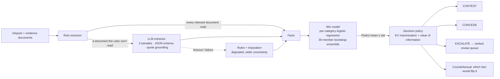

# Abstain

**A chargeback decision service that knows when not to decide.**

An LLM reads the dispute evidence and extracts verifiable facts. A calibrated model turns those facts into a win
probability *with uncertainty*. A deterministic policy then picks CONTEST, CONCEDE or ESCALATE by expected value, and
escalates to a human only when the value of that human's answer exceeds the cost of their time.

[](https://github.com/cherry51015/Abstain/actions/workflows/ci.yml)
· Python · FastAPI · PostgreSQL · SQLAlchemy/Alembic · httpx/asyncio · NumPy · Prometheus · Docker

---

## How it works


```mermaid
flowchart LR
    D[Dispute + evidence documents] --> R[Rule extractor]
    R -->|every relevant document read| F[Facts]
    R -->|a document the rules can't read| L[LLM extractor<br/>3 samples · JSON schema · quote grounding]
    L --> F
    L -.->|timeout / failure| R2[Rules + imputation<br/>degraded, wider uncertainty]
    R2 --> F
    F --> M[Win model<br/>per-category logistic regression<br/>30-member bootstrap ensemble]
    M -->|"P(win) mean ± std"| P[Decision policy<br/>EV maximisation + value of information]
    P --> C[CONTEST] & X[CONCEDE] & E[ESCALATE → ranked review queue]
    P --> CF[Counterfactual: which fact would flip it]
```

| Stage | What it does | Where |
|---|---|---|
| Extraction | Rules first; the LLM is called only when a document that should answer a relevant fact exists but the rules could not read it. The LLM's answers must quote the documents verbatim or they are discarded. | [`extraction/`](app/extraction) |
| Estimation | Facts → P(win). Uncertainty is Monte Carlo over *LLM samples × ensemble members*, plus imputation of facts no extractor could read. | [`scoring/win_model.py`](app/scoring/win_model.py) |
| Decision | Pure function of the estimate and the case economics. Imports nothing from the AI side. | [`engine/decision_engine.py`](app/engine/decision_engine.py) |
| Diagnosis | Three levels: *this* dispute (what evidence would flip it), *this* merchant (its weakness benchmarked against the rest of the portfolio), the portfolio (gaps shared by separate merchants). | [`engine/counterfactual.py`](app/engine/counterfactual.py), [`insights.py`](app/insights.py) |
| Service | Async HTTP API, append-only evaluations with a step-by-step audit trail, idempotency keys, human review, outcome recording, calibration monitoring. | [`api/`](app/api), [`repository.py`](app/repository.py) |

## Three levels of diagnosis

A decision alone does not tell anyone what to fix. Abstain explains at three levels.

**1. This dispute: what would flip it?** Every CONCEDE or ESCALATE comes with a ranked checklist of every *minimal*
evidence set that would turn it into CONTEST, with its rupee impact and what it takes. It is computed by re-running
the real model and policy with facts changed (no LLM calls, no separate what-if logic to drift out of sync). For
the ₹40,000 card-not-present fraud dispute in the console's examples, whose authorization record the rules could
not read, it returns:

| evidence | what it takes | P(win) after | EV gain |
|---|---|---|---|
| `avs_cvv_match` | probably already in the documents; confirm | 46% | +₹7,560 |
| `ip_consistent_with_cardholder` | probably already in the documents; confirm | 45% | +₹7,117 |
| `delivery_confirmed` | collect it | 42% | +₹6,067 |

Each fact is typed by why it is not favourable today:
- *missing*: go and collect it
- *unread*: it may already be in a document
- *adverse*: the documents say no, so the fix is operational, not more evidence

**2. This merchant: why does it keep losing?** Each merchant's primary weakness is benchmarked against the *rest*
of the portfolio with a two-proportion z-test, so a raw rate is never mistaken for a merchant problem:

> **`signed_by_cardholder`** was weak in **32 of 35** losses where it mattered. Weak in 88% of this merchant's
> disputes vs 49% for the rest of the portfolio (z = 5.84): **merchant-specific**.

**3. The portfolio: why are we losing?** A fact missing in most disputes of several separate merchants, *and*
whose absence measurably raises the loss rate, is systemic:

> **`prior_undisputed_orders`** is missing in 80% of relevant disputes across 8 merchants, and disputes without it
> lose 69% of the time vs 40% with it: fix the shared evidence pipeline, not individual merchants.

These two outputs come from [`eval/PORTFOLIO_REPORT.md`](eval/PORTFOLIO_REPORT.md), produced by
[`scripts/portfolio_demo.py`](scripts/portfolio_demo.py) (it also runs in CI):
- 1,200 disputes with **planted** process problems go through the real HTTP API: evaluate, then record the outcome.
- The reports must recover exactly the planted problems and nothing else.
- Result: 4/4 checks pass. Both merchant-specific problems and the systemic gap are found, with zero false alarms.

Two statistical traps the analysis avoids, both caught while building it:
- **Conditioning on losses.** Measuring weakness only among lost disputes makes every fact look weak, because
  losing cases are weak cases. Rates are measured over all disputes.
- **Confounding.** A delivery signature cannot exist when nothing was delivered. Counting "no signature" on failed
  deliveries blamed signatures for losses that delivery failure caused. Facts are only counted where they are
  possible ([`FACT_PREREQUISITES`](app/domain.py)).

**Audit trail.** Every evaluation stores each pipeline step with timings:
- which documents the rules could not read, and why the LLM was or was not called
- samples used, ungrounded answers discarded, and tokens spent
- what was imputed, the P(win) spread, the decision arithmetic, and the counterfactual

## Results

From [`eval/REPORT.md`](eval/REPORT.md): 250 test disputes per split, 95% paired bootstrap CIs. *Oracle* = the
true facts (upper bound for extraction), *rules* = the deterministic extractor.

**Decisions (familiar document wording)**

| policy | expected net (₹) | vs contest-everything |
|---|---|---|
| concede everything | 0 | −428,698 |
| contest everything | 428,698 | — |
| **Abstain** (rules extraction) | **479,777** | **+51,079 (+12%)**, CI [+41,332, +60,932] |
| best possible (contest exactly when true EV > 0) | 481,386 | +52,688 |

Abstain recovers **99.7%** of the best achievable value. An earlier version of this project lost ₹55k against the
same contest-everything baseline; the design decisions below are what changed.

**Probabilities and uncertainty**

| | AUC | Brier | ECE | 90%-interval coverage (target 0.90) |
|---|---|---|---|---|
| familiar wording | 0.885 | 0.136 | 0.031 | **0.90** |
| unfamiliar wording, rules only | 0.596 | 0.236 | 0.083 | **0.87** |

**Robustness to unfamiliar wording** (`test_shifted`, phrasing written after the rules were frozen)

| | rules extraction accuracy | Abstain vs contest-everything |
|---|---|---|
| familiar wording | 99.7% | +₹51,079 |
| unfamiliar wording, rules only | **8.7%** | +₹26,160, CI [+15,160, +36,747] |

The rules collapse on wording they were not written for, but the damage is contained: facts the rules could not
read are imputed, which widens the uncertainty and routes the unreadable cases (12%) to a human instead of
guessing. Without imputation the same setting gained only +₹8k, with a CI crossing zero.

**LLM extraction:** the LLM and cascade systems on the same splits are still running (the free-tier provider caps
tokens per day; responses are cached so the run resumes). The cascade's measured property so far: on familiar
wording it made **zero LLM calls**, because the rules read every document.

## Design decisions (and what I measured)

**1. The LLM extracts facts; it does not score the case.**
The first version asked the LLM for an "evidence strength" number. But it only showed the LLM a list of which
evidence types were present, so the number was a re-derivation of a count that one line of Python computes. Now
the LLM answers nine yes/no/unknown questions about the actual document text ("was it signed by the cardholder?").
Facts are checkable against labels, so extraction accuracy is measured on its own, separately from model error
and outcome noise.

**2. Hallucinations are blocked structurally, not by prompting.** Every yes/no must come with a verbatim quote. If
the quote is not in the documents, the answer becomes `unknown` and is counted
([`parse_and_ground`](app/extraction/llm_extractor.py)). Documents are customer-supplied, so they are fenced as
untrusted data. The grounding check also limits prompt injection: an injected instruction can only make the model
cite text that really exists.

**3. Rules first, LLM for the long tail.** The rule extractor reads the phrasing it was written for almost
perfectly and fails on anything else, and it usually fails by returning "unknown" rather than a wrong answer. So
the cascade only pays for LLM calls where the rules could not read a document that exists.

**4. Uncertainty that means something.** P(win) comes from a 30-member bootstrap ensemble of per-category logistic
regressions, shipped as reviewable JSON coefficients (no pickle). The spread combines disagreement between LLM
self-consistency samples and disagreement between ensemble members. When the rules cannot read a document and no
LLM is available, the missing facts are *imputed from training priors*, not silently treated as neutral. On
unfamiliar phrasing this turned the rules-only system's gain over contest-all from not significant (+₹8k, CI crossing
zero) into significant (+₹26k).

**5. Escalation is priced, not thresholded.** ESCALATE is the third action in one expected-value maximisation. With
X = P(win)·amount − cost, a reviewer who resolves the uncertainty is worth E[max(X,0)] − max(E[X],0): the value of
information, which has a closed form under a Normal approximation. The case escalates when that exceeds the review
cost. The review queue is ranked by the same quantity, not by arrival order. Merchant risk appetite changes how
much oversight they buy (the review-cost multiplier), and nothing else.

**6. Contradictory evidence widens uncertainty instead of forcing escalation.** An earlier version escalated every contradiction.
The eval showed that cost more in review time than it recovered, so a contradiction now raises the uncertainty
floor and the value-of-information test decides.

**7. Things I removed, and why.**
- *The "chargeback-ratio penalty" on contesting.* Winning a representment does not remove a dispute from the card
  network's monitoring ratio (e.g. Visa VAMP counts it on receipt), so the penalty charged contesting for a cost it
  does not have. Ratio proximity now appears in the insights report, where it belongs: as a prevention signal.
- *Hybrid BM25 + FAISS retrieval.* It searched eight reason codes, which arrive structured from the network anyway.
  Removing it took torch, FAISS and sentence-transformers out of the runtime image, which is what the old
  free-tier deployment was struggling to run.
- *LangGraph.* The pipeline is linear; a typed function call chain is easier to test and reason about.

**8. Reliability.**
- The LLM client is written directly on httpx, so the behaviour is explicit and tested ([`llm_client.py`](app/extraction/llm_client.py)):
  - per-request timeouts
  - retries only on retryable statuses, with exponential backoff, full jitter and `Retry-After` honoured
  - a shared concurrency cap and client-side request pacing
  - a content-addressed response cache, which also makes evals resumable
- Each evaluation has an overall latency budget. On timeout or failure it falls back to rules with imputation, is
  flagged `degraded`, and is counted in Prometheus.
- Output tokens turned out to be the binding provider limit, so the prompt omits unaddressed facts and asks for
  compact JSON. That halved output tokens per call.

**9. Data model built for audit and feedback.**
- Evaluations are append-only. Each stores its input snapshot, merchant snapshot and model version.
- Money is `Numeric(12,2)`. Schema changes go through Alembic, and CI checks that migrations and models don't drift,
  on real Postgres.
- Reviewers resolve escalations (`POST /review`), and network outcomes are recorded later (`POST /outcome`). Those
  outcomes drive root-cause reports (*missing* evidence vs *adverse* evidence need different fixes) and live
  calibration monitoring, which alerts when ECE drifts.
- `POST /evaluate` supports Stripe-style `Idempotency-Key`: the same key and body replays the result, and the same
  key with a different body returns 409. It is race-safe.

## Evaluation methodology

Real chargeback data with evidence documents and outcomes is not public, so
[`scripts/generate_dataset.py`](scripts/generate_dataset.py) builds a synthetic dataset with **known truth at every
stage**:
- latent facts → rendered documents (varied phrasing, negations, near-miss names, amount mismatches) → outcome
  drawn from the facts the documents express
- train / val / test (1000 / 250 / 250) share one phrasing family
- **test_shifted** uses a held-out phrasing bank written *after* the rule extractor was frozen, to measure
  robustness to wording nobody tuned against

[`eval/run_eval.py`](eval/run_eval.py) scores each stage separately:
- **Extraction:** per-fact accuracy.
- **P(win):** Brier, ECE and AUC, plus MAE against the generator's true probability, which isolates error caused by
  extraction.
- **As a classifier:** precision and recall (positive = CONTEST, truth = the dispute was won), with false-positive
  cost (contest cost wasted on losses) and false-negative cost (winnable amounts conceded). ESCALATE is excluded and
  reported as a rate, because abstaining is not a wrong prediction.
- **Decision boundary:** a sweep of the review cost, the knob that sets how readily the engine abstains. Cheaper
  review → more escalation → higher precision and lower false-positive cost. For example, on the oracle facts
  precision goes 0.58 → 0.85 and FP cost ₹34k → ₹4k as review cost goes from never-escalate to free.
- **Policy:** net rupees against baselines, with paired bootstrap 95% CIs. Policies are scored both *in expectation*
  (using the true P(win), which removes coin-flip noise) and *realized* (using sampled outcomes, like a backtest).
  Escalated cases pay the review cost and are then decided by a reviewer who knows the true P(win). That is a
  best-case human, so `abstain_no_escalation` is reported alongside to isolate what escalation itself adds.

**Limitations, stated plainly.**
- The documents are synthetic, template-based text, so absolute accuracies will not transfer to real evidence. The
  *comparisons* (rules vs LLM under distribution shift, cascade cost, escalation value) are what the eval is for.
- The LLM run uses a free-tier model on 100 cases per split because of rate limits, so its CIs will be wider.
- The win model is trained on ground-truth facts standing in for analyst-reviewed history.

## API

| Method | Path | |
|---|---|---|
| POST | `/v1/disputes/evaluate` | Evaluate a dispute. Honours `Idempotency-Key`. `X-API-Key` is required if configured. |
| GET | `/v1/disputes/{case_id}` | Latest evaluation plus full history |
| GET | `/v1/escalations?limit&offset` | Open escalations ranked by net value of review |
| POST | `/v1/disputes/{case_id}/review` | Human resolves an escalation (409 if not escalated or already reviewed) |
| POST | `/v1/disputes/{case_id}/outcome` | Record the network's resolution |
| GET | `/v1/reports/portfolio`, `/v1/reports/merchants/{id}` | Merchant weaknesses benchmarked against the portfolio, systemic gaps, missing vs adverse evidence, realized economics |
| GET | `/v1/monitoring/calibration` | Live Brier/ECE of P(win) on resolved cases, with drift alert |
| GET | `/health`, `/ready`, `/metrics` | Liveness, readiness (DB + model), Prometheus |

Interactive docs are at `/docs`. A dependency-free console is in [`frontend/index.html`](frontend/index.html).

## Running it

```bash
pip install -r requirements-dev.txt
cp .env.example .env              # GROQ_API_KEY optional: without it the service runs rules-only
alembic upgrade head
uvicorn app.main:app --reload     # http://localhost:8000/docs
python -m http.server 5173 -d frontend   # console at http://localhost:5173
```

```bash
docker compose up --build         # API + Postgres, migrations run on start
pytest                            # ~100 tests: unit, property-based, HTTP, migrations
python eval/run_eval.py           # offline eval (oracle + rules), no API calls
python eval/run_eval.py --llm --limit 100   # adds LLM + cascade (uses API quota; cached and resumable)
python scripts/portfolio_demo.py   # levels 2-3: planted-problem check through the real API
python scripts/generate_dataset.py && python scripts/train_win_model.py   # rebuild data + model
```

## Layout

```text
app/
  domain.py            facts, documents, cases: the contract between layers
  extraction/          rules · LLM client (retries, pacing, cache) · grounded LLM extractor · sample aggregation
  scoring/             win model (bootstrap ensemble, imputation) · forecast metrics
  engine/              decision policy (EV + value of information) · counterfactuals · conflict rules
  service.py           extraction modes, cascade, degraded fallback
  api/ db.py repository.py insights.py observability.py main.py
alembic/               migrations
scripts/               dataset generator, model training
eval/                  evaluation harness + REPORT.md
tests/                 pytest + hypothesis
```

## What I would do next

- Replace synthetic documents with a small hand-labelled set of real, anonymised evidence and re-run the same harness.
- Move evaluation off the request path (a queue and workers) so long LLM budgets never hold an HTTP request open.
- Recalibrate the win model from recorded outcomes when the calibration monitor alerts, behind a shadow-evaluation gate.
